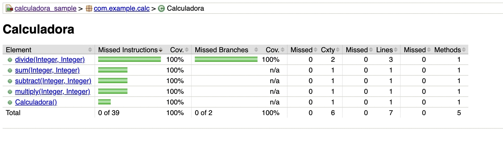
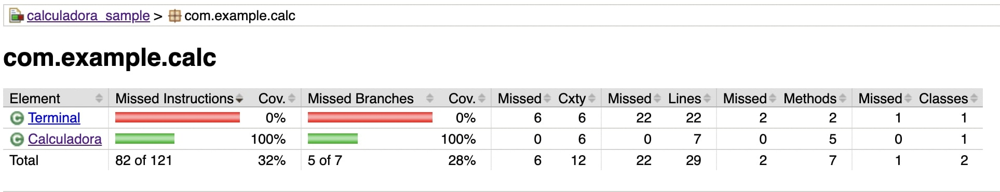
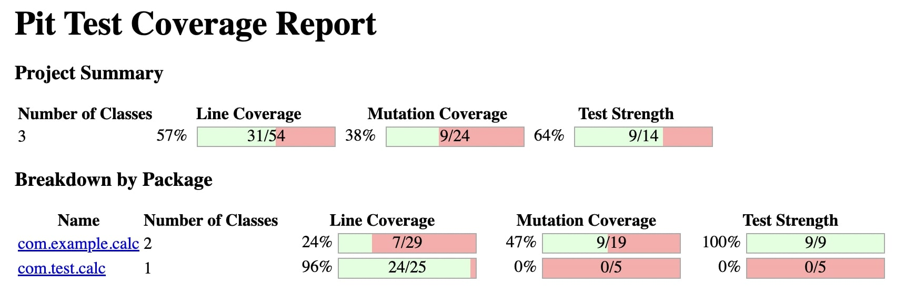

# calculadora_sample
Just a test exercise with a calculator

This project was just for the purpose of exercising a little about java and some tests.

Requirements:
it is necessary to have gradle and java installed on the machine (at least JDK-17 version, but jdk 11 can be used)

To execute the project:
With every installation, just run:
`./gradlew build`

To run the tests
`./gradlew test`

To run the Code Coverage Report:
`./gradlew jacocoTestReport`

To run coverage check:
`./gradlew jacocoTestCoverageVerification`

Considerations:
Due to the time of the task, some points were not as good as I would like.
Mutation tests: It was added to the project, but if you try to run it through terminal, it gives an error.
To solve this difficulty, I chose to install the plugin, in the IDE, and check, occasionally, there.
Plugin used: https://plugins.jetbrains.com/plugin/7119-pit-mutation-testing

Property Based Tests:
I implemented a simple test using JUnit-Quickcheck , but as I hadn't used it in java yet, I think that some configuration is not fully adjusted and its execution is not going well. With that I left the example class, but it will not run.

Improvements to be made;

1) Tests in the Terminal class, to avoid different integer values ​​in the number fields.
2) Tune mutation tests to run correctly by command line.
3) Adjust property based tests and increment them
4) Adjustment in the pipeline to have better visibility of the tests executed
5) create dockerfile and docker compose to avoid problems with dependencies

Images of the reports of an execution:

Cobertura:

Pitest

